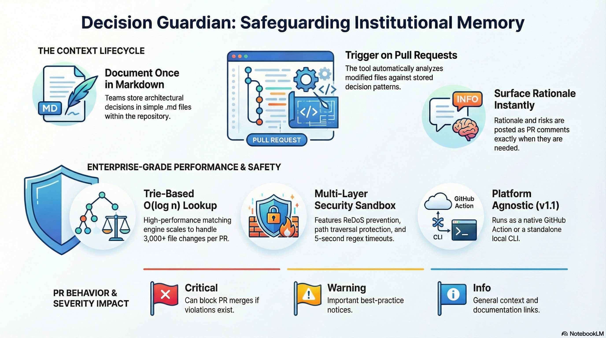

<p align="center">
  
</p>

# Decision Guardian

> **Prevent institutional amnesia by surfacing past architectural decisions directly on Pull Requests (or locally via CLI).**

[](https://github.com/marketplace/actions/decision-guardian)
[](https://www.npmjs.com/package/decision-guardian)
[](LICENSE)
[](https://decispher.com)
[](https://decision-guardian.decispher.com/)
[](SECURITY.md)

**Created by [Ali Abbas](https://github.com/gr8-alizaidi) • Part of the [Decispher](https://decispher.com) project**

---

## What is Decision Guardian?

Engineering teams lose critical context when senior engineers leave, architectural decisions go undocumented, or new developers modify sensitive code without understanding the *why* behind it.

Decision Guardian solves this. You write decisions once in **simple Markdown files** — when a PR touches protected code, Decision Guardian **automatically surfaces the relevant context** as a PR comment or CLI output.

<p align="center">
  
</p>

---

## ✨ Key Capabilities

- 🛡️ **Automatic Context Surfacing** — Posts PR comments when protected files change, grouped by severity (Critical, Warning, Info)
- 🎯 **Flexible Matching** — Glob patterns, regex, content matching, boolean logic (AND/OR), JSON path, line ranges
- ⚡ **Enterprise-Grade Performance** — Trie-based O(log n) lookup, handles 3,000+ file PRs, streaming mode
- 🔒 **Security-First** — ReDoS prevention, path traversal protection, Zod validation, VM sandboxed regex
- 🔄 **Smart Behavior** — Idempotent comments, self-healing duplicate cleanup, progressive truncation
- 💻 **CLI + GitHub Action** — Works locally, in any CI system (GitLab, Jenkins, CircleCI), or as a native GitHub Action
- 🔏 **Privacy-First Telemetry** — Opt-out with `DG_TELEMETRY=0`. No source code ever leaves your repo. See [PRIVACY.md](PRIVACY.md)

---

## 🚀 Quick Start

### Option 1: GitHub Action

**1. Create a decision file** — `.decispher/decisions.md`:

```markdown
<!-- DECISION-DB-001 -->
## Decision: Database Choice for Billing

**Status**: Active  
**Date**: 2024-03-15  
**Severity**: Critical

**Files**:
- `src/db/pool.ts`
- `config/database.{yml,yaml}`

### Context

We chose Postgres over MongoDB because billing requires ACID compliance.
MongoDB doesn't guarantee consistency for financial transactions.

---
```

**2. Add workflow** — `.github/workflows/decision-guardian.yml`:

```yaml
name: Decision Guardian

on:
  pull_request:

permissions:
  pull-requests: write
  contents: read

jobs:
  check:
    runs-on: ubuntu-latest
    steps:
      - uses: actions/checkout@v4
      
      - uses: DecispherHQ/decision-guardian@v1
        with:
          token: ${{ secrets.GITHUB_TOKEN }}
          decision_file: '.decispher/decisions.md'
          fail_on_critical: true
```

**3. Done!** — Open a PR modifying `src/db/pool.ts` → Decision Guardian comments with context from `DECISION-DB-001`.

> 📖 For production-ready configuration (concurrency, outputs, etc.), see the [full documentation](https://decision-guardian.decispher.com/docs).

---

### Option 2: CLI

```bash
# Install globally
npm install -g decision-guardian

# Or use directly without installation
npx decision-guardian --help

# Check staged changes
decision-guardian check .decispher/decisions.md

# Check against a branch
decision-guardian check .decispher/decisions.md --branch main

# Auto-discover all decision files
decision-guardian checkall --fail-on-critical

# Initialize a new project with template
decision-guardian init --template security
```

**Use in any CI system** — GitLab, Jenkins, CircleCI, pre-commit hooks, and more. See [CLI docs](docs/cli/CLI.md).

---

## 🤝 Contributing

We welcome contributions! Decision Guardian is open source (MIT) and maintained by [Decispher](https://decispher.com).

1. **Report Bugs** — [Open an issue](https://github.com/DecispherHQ/decision-guardian/issues)
2. **Suggest Features** — [Start a discussion](https://github.com/DecispherHQ/decision-guardian/discussions)
3. **Submit PRs** — See [Contributing.md](Contributing.md)
4. **Improve Docs** — Fix typos, add examples
5. **Share** — ⭐ Star the repo, write blog posts

### Development

```bash
git clone https://github.com/DecispherHQ/decision-guardian.git
cd decision-guardian
npm install
npm test
npm run build
```

---

## ❓ FAQ

**Q: Can it prevent merges?**  
A: Yes, when `fail_on_critical: true`. Admins can still override.

**Q: Works with monorepos?**  
A: Yes. Use path-specific patterns.

**Q: Works with private repos?**  
A: Yes. Uses `GITHUB_TOKEN` — no code leaves your repo.

**Q: Difference vs CODEOWNERS?**  
A: CODEOWNERS assigns *who* reviews. Decision Guardian explains *why* it matters. Use both.

**Q: How do I skip for specific PRs?**  
A: Add a label condition:
```yaml
if: "!contains(github.event.pull_request.labels.*.name, 'skip-decisions')"
```

**Q: Other CI/CD platforms?**  
A: The CLI works everywhere (GitLab, Jenkins, etc.). Native PR commenting is GitHub Actions only.

---

## 💬 Support

- 🌐 **Website**: [decision-guardian.decispher.com](https://decision-guardian.decispher.com/)
- 💬 **Community**: [GitHub Discussions](https://github.com/DecispherHQ/decision-guardian/discussions)
- 🐛 **Issues**: [Bug Reports](https://github.com/DecispherHQ/decision-guardian/issues)
- 🏢 **Enterprise**: [Decispher Support](https://decision-guardian.decispher.com/support)
- 📧 **Email**: [decispher@gmail.com](mailto:decispher@gmail.com)

---

## 📄 License

**MIT License** — See [LICENSE](LICENSE) for details.  
Decision Guardian is free and open source.

---

## About

**Decision Guardian** is created and maintained by **[Ali Abbas](https://github.com/gr8-alizaidi)** as part of [Decispher](https://decispher.com) — helping engineering teams preserve and leverage institutional knowledge.

**Connect:**
- GitHub: [@gr8-alizaidi](https://github.com/gr8-alizaidi)
- Twitter: [@gr8_alizaidi](https://twitter.com/gr8_alizaidi)

---

## 🙏 Acknowledgments

Built with [minimatch](https://github.com/isaacs/minimatch), [parse-diff](https://github.com/sergeyt/parse-diff), [zod](https://github.com/colinhacks/zod), [safe-regex](https://github.com/substack/safe-regex), and [@actions/toolkit](https://github.com/actions/toolkit).

Inspired by [Architecture Decision Records (ADR)](https://adr.github.io/) and [CODEOWNERS](https://docs.github.com/en/repositories/managing-your-repositorys-settings-and-features/customizing-your-repository/about-code-owners).

---

## 🌟 Show Your Support

If Decision Guardian helps your team, please:
- ⭐ **Star** this repository
- 🐦 **Tweet** about it 
- 📝 **Write** a blog post
- 💼 **Recommend** it to colleagues

---

## 📚 Resources

| Resource | Link |
|----------|------|
| 🌐 Website | [decision-guardian.decispher.com](https://decision-guardian.decispher.com/) |
| 📖 Documentation | [decision-guardian.decispher.com/docs](https://decision-guardian.decispher.com/docs) |
| 📝 Blog | [decision-guardian.decispher.com/blog](https://decision-guardian.decispher.com/blog) |
| 🛠️ Markdown Builder (GUI) | [decision-markdown-builder.decispher.com](https://decision-markdown-builder.decispher.com/) |
| 🎬 YouTube Walkthrough | [Watch on YouTube](https://www.youtube.com/watch?v=lhBDYqzhL24) |
| 📐 Architecture | [ARCHITECTURE.md](docs/common/ARCHITECTURE.md) |
| 📋 Decision File Format | [DECISIONS_FORMAT.md](docs/common/DECISIONS_FORMAT.md) |
| 💻 CLI Reference | [CLI.md](docs/cli/CLI.md) |
| ⚙️ GitHub Action Details | [APP_WORKING.md](docs/github/APP_WORKING.md) |
| 🔏 Telemetry & Privacy | [TELEMETRY.md](docs/common/TELEMETRY.md) · [PRIVACY.md](PRIVACY.md) |
| 📝 Templates | [TEMPLATES.md](docs/common/TEMPLATES.md) |
| 🗺️ Roadmap | [FEATURES_ROADMAP.md](docs/common/FEATURES_ROADMAP.md) |
| 🔐 Security | [SECURITY.md](SECURITY.md) |
| 📓 Changelog | [CHANGELOG.md](CHANGELOG.md) |

---

**Made with ❤️ by [Decispher](https://decispher.com)**

*Preventing institutional amnesia, one PR at a time.*