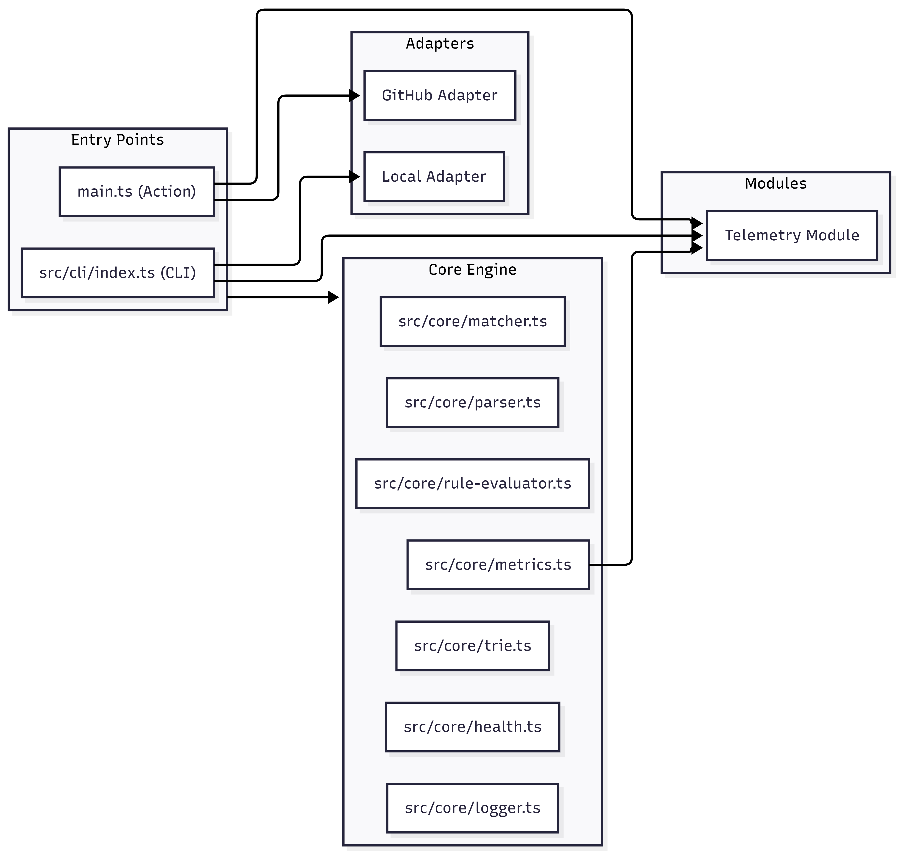
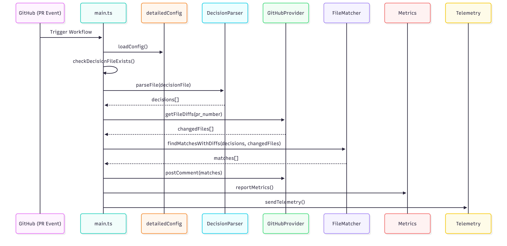
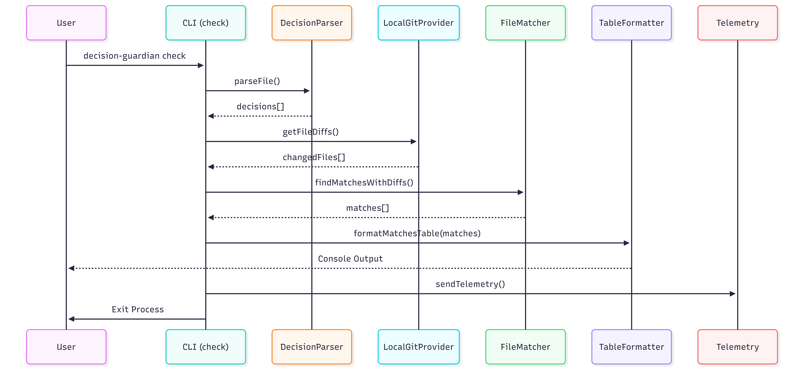

# Architecture

## Overview

Decision Guardian is a platform-agnostic tool for surfacing architectural decisions on code changes. It runs as both a GitHub Action and a standalone CLI.

> Diagram source (editable): [`docs/mermaid_code.md`](../mermaid_code.md#system-architecture)

## Design Principles

1. **Dependency Inversion**: Core engine depends on interfaces (`ILogger`, `ISCMProvider`), not concrete implementations.
2. **Adapter Pattern**: Platform-specific code is isolated in `src/adapters/`.
3. **Zero PII in telemetry**: Privacy blocklist enforced at the module boundary.
4. **Fire-and-forget**: Telemetry never blocks or affects tool behavior.

## Module Map

### Core (`src/core/`)

| File | Responsibility |
|------|---------------|
| `parser.ts` | Markdown → structured decisions (AST-based) |
| `matcher.ts` | File-to-decision matching with glob + trie |
| `rule-evaluator.ts` | Advanced JSON rule evaluation (regex, content, boolean logic) |
| `trie.ts` | Prefix trie for O(log n) file lookups |
| `metrics.ts` | Platform-agnostic metrics collection |
| `logger.ts` | Structured logging helper |
| `health.ts` | Decision file existence checks |
| `types.ts` | Shared type definitions |
| `rule-types.ts` | Rule system type definitions |

### Adapters (`src/adapters/`)

| File | Responsibility |
|------|---------------|
| `github/actions-logger.ts` | `ILogger` → `@actions/core` |
| `github/github-provider.ts` | `ISCMProvider` → GitHub API |
| `github/comment.ts` | PR comment management |
| `github/health.ts` | Token validation |
| `local/console-logger.ts` | `ILogger` → colored console output |
| `local/local-git-provider.ts` | `ISCMProvider` → local `git diff` |

### CLI (`src/cli/`)

| File | Responsibility |
|------|---------------|
| `index.ts` | Entry point, arg parsing, command routing |
| `commands/check.ts` | `check` / `checkall` command |
| `commands/init.ts` | Scaffold `.decispher/` directory |
| `commands/template.ts` | Template listing and output |
| `formatter.ts` | ANSI-colored tables and summaries |
| `paths.ts` | Template directory resolution |

### Telemetry (`src/telemetry/`)

| File | Responsibility |
|------|---------------|
| `payload.ts` | Type-safe payload builder |
| `privacy.ts` | Blocklist validation |
| `sender.ts` | Opt-in fire-and-forget sender |

### Worker (`workers/telemetry/`)

| File | Responsibility |
|------|---------------|
| `worker.ts` | Cloudflare Worker: collect + aggregate |
| `wrangler.toml` | Deployment configuration |

## Data Flow

### GitHub Action

> Diagram source (editable): [`docs/mermaid_code.md`](../mermaid_code.md#data-flow-github-action)

### CLI

> Diagram source (editable): [`docs/mermaid_code.md`](../mermaid_code.md#data-flow-cli)

## Build Outputs

| Script | Output | Size |
|--------|--------|------|
| `npm run bundle` | `dist/index.js` | Action entry point |
| `npm run build:cli` | `dist/cli/index.js` | CLI bundle (~430KB) |
