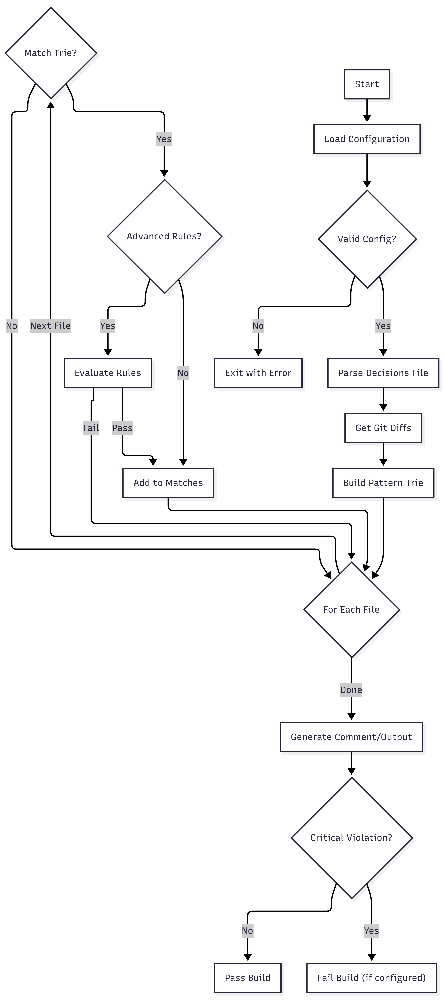

# Decision Guardian - Technical Overview

**Author**: Ali Abbas  
**Project**: Decispher

---

## Overview

Decision Guardian is a GitHub Action that surfaces architectural decisions when Pull Requests modify protected files. It prevents institutional amnesia by making past decisions visible at code review time.

**Core Value**: Teams document decisions once, Decision Guardian surfaces them automatically when relevant.

---

## System Architecture

### High-Level Flow



See interactive image [here](../mermaid_code.md#high-level-flow)
---

## Component Architecture (v1.1)

```
src/
├── main.ts                          # GitHub Action Orchestrator
│   ├─► Loads configuration
│   ├─► Coordinates all components
│   ├─► Reports metrics
│   └─► Sends telemetry (opt-in)
│
├── core/                            # Platform-agnostic engine
│   ├── interfaces/
│   │   ├── logger.ts                # ILogger interface
│   │   └── scm-provider.ts          # ISCMProvider interface
│   │
│   ├── parser.ts                    # Decision Parser
│   │   ├─► Parses Markdown files
│   │   ├─► Extracts structured data
│   │   ├─► Validates format
│   │   └─► Supports directory scanning
│   │
│   ├── matcher.ts                   # File Matcher
│   │   ├─► Uses Trie for O(log n) lookup
│   │   ├─► Evaluates glob patterns
│   │   ├─► Accepts ILogger (injected)
│   │   └─► Coordinates rule evaluation
│   │
│   ├── rule-evaluator.ts            # Advanced Rules
│   │   ├─► Evaluates JSON rules
│   │   ├─► Boolean logic (AND/OR)
│   │   ├─► Content matching
│   │   └─► Parallel processing (batch 50)
│   │
│   ├── content-matchers.ts          # Content Matching
│   │   ├─► String mode
│   │   ├─► Regex mode (VM sandbox, 5s timeout)
│   │   ├─► Line range mode
│   │   ├─► Full file mode
│   │   └─► JSON path mode
│   │
│   ├── trie.ts                      # Pattern Trie
│   ├── rule-parser.ts               # Rule Parser
│   ├── metrics.ts                   # MetricsCollector + getSnapshot()
│   ├── logger.ts                    # logStructured() (ILogger-based)
│   ├── health.ts                    # checkDecisionFileExists()
│   ├── types.ts                     # Core types
│   └── rule-types.ts                # Rule types
│
├── adapters/
│   ├── github/
│   │   ├── actions-logger.ts        # ILogger → @actions/core
│   │   ├── github-provider.ts       # ISCMProvider → GitHub API
│   │   ├── comment.ts               # PR comment management
│   │   └── health.ts                # validateToken()
│   └── local/
│       ├── console-logger.ts        # ILogger → ANSI console
│       └── local-git-provider.ts    # ISCMProvider → git diff
│
├── cli/
│   ├── index.ts                     # #!/usr/bin/env node
│   ├── commands/
│   │   ├── check.ts                 # check / checkall
│   │   ├── init.ts                  # scaffold .decispher/
│   │   └── template.ts             # template output
│   ├── formatter.ts                 # Colored output tables
│   └── paths.ts                     # Template path resolution
│
└── telemetry/
    ├── sender.ts                    # Opt-in fire-and-forget
    ├── payload.ts                   # Type-safe builder
    └── privacy.ts                   # Blocklist validation

workers/telemetry/                   # Cloudflare Worker backend
├── worker.ts                        # POST /collect + GET /stats
├── wrangler.toml                    # Deployment config
└── README.md                        # Setup instructions

templates/                           # Decision file templates
├── basic.md
├── advanced-rules.md
├── security.md
├── database.md
└── api.md
```

> **Design principle**: `src/core/` has **zero** `@actions/*` imports. All platform-specific code lives in `src/adapters/`. New SCM providers (GitLab, Bitbucket) are added by implementing `ISCMProvider` — no core changes needed.

---

## Data Flow

### 1. Configuration Phase

```typescript
// Load and validate configuration
const config = {
  decisionFile: string,      // .decispher/decisions.md or directory
  failOnCritical: boolean,   // Block PR on critical violations?
  failOnError: boolean,      // Block on parse errors?
  telemetryEnabled: boolean, // Anonymous metrics?
  token: string              // GitHub token
};

// Validated using Zod schemas
ConfigSchema.parse(rawConfig);
```

**Security checks**:
- Path must be relative (no absolute paths)
- No path traversal (`..` not allowed)
- Token must be non-empty

### 2. Parsing Phase

**Input**: `.decispher/decisions.md` or directory

**Process**:
1. Read file(s) from filesystem
2. Split into decision blocks (by `<!-- DECISION-ID -->` markers)
3. Extract fields using regex patterns
4. Parse JSON rules (if present)
5. Validate structure and warn on errors

**Output**: Array of `Decision` objects

```typescript
interface Decision {
  id: string;                    // DECISION-001
  title: string;
  date: string;                  // YYYY-MM-DD
  status: DecisionStatus;        // active, deprecated, etc.
  severity: Severity;            // critical, warning, info
  files: string[];               // Glob patterns
  rules?: RuleCondition;         // Advanced rules (optional)
  context: string;               // Explanation text
  sourceFile: string;            // Path to .md file
  lineNumber: number;            // For error reporting
}
```

### 3. File Matching Phase

**Input**: 
- Array of decisions
- Array of changed files (from GitHub API)

**Process**:

```typescript
// 1. Build Trie index from decisions
const trie = new PatternTrie(activeDecisions);

// 2. For each changed file:
for (const file of changedFiles) {
  // a. Get candidates from Trie (O(log n))
  const candidates = trie.findCandidates(file);
  
  // b. Verify with glob matching
  for (const decision of candidates) {
    if (matchesGlobPattern(file, decision.files)) {
      // c. Evaluate advanced rules (if present)
      if (decision.rules) {
        const result = await ruleEvaluator.evaluate(
          decision.rules,
          fileDiff
        );
        if (result.matched) {
          matches.push({ file, decision, ...result });
        }
      } else {
        matches.push({ file, decision });
      }
    }
  }
}
```

**Output**: Array of `DecisionMatch` objects

### 4. Comment Generation Phase

**Input**: Array of matches

**Process**:

```typescript
// 1. Sort matches (by decision ID, then file)
matches.sort((a, b) => {
  if (a.decision.id !== b.decision.id) {
    return a.decision.id.localeCompare(b.decision.id);
  }
  return a.file.localeCompare(b.file);
});

// 2. Generate content hash
const hash = crypto
  .createHash('sha256')
  .update(matches.map(m => `${m.decision.id}:${m.file}`).join('|'))
  .digest('hex')
  .substring(0, 16);

// 3. Find existing comment
const existing = await findExistingComments(pr);

// 4. Compare hashes
if (existing && extractHash(existing.body) === hash) {
  // Skip update (content unchanged)
  return;
}

// 5. Format comment
const comment = formatComment(matches, hash);

// 6. Update or create
if (existing) {
  await updateComment(existing.id, comment);
} else {
  await createComment(pr, comment);
}
```

**Comment structure**:
```markdown
<!-- decision-guardian-v1 -->
<!-- hash:abc123def456 -->

## ⚠️ Decision Context Alert

This PR modifies N file(s)...

### 🔴 Critical Decisions (N)
[Grouped critical matches]

### 🟡 Important Decisions (N)
[Grouped warning matches]

### ℹ️ Informational (N)
[Grouped info matches]

---
*🤖 Generated by Decision Guardian*
```

---

## Performance Optimizations

### 1. Trie-Based Pattern Matching

**Problem**: Naive O(N×M) comparison (N decisions × M files)

**Solution**: Prefix Trie with O(log n) lookup

```typescript
// Build Trie from decision patterns
class PatternTrie {
  insert(pattern: string, decision: Decision) {
    const parts = pattern.split('/');
    // Insert into tree structure
    // Handles: exact matches, *, **, wildcards
  }
  
  findCandidates(file: string): Set<Decision> {
    const parts = file.split('/');
    // Traverse tree, collect candidates
    // Returns only potentially matching decisions
  }
}
```

**Impact**: 10-100x faster for large decision sets

### 2. Regex Caching

**Problem**: Repeated regex compilation and evaluation

**Solution**: Cache by content hash

```typescript
class ContentMatchers {
  private cache = new Map<string, boolean>();
  
  matchRegex(pattern: string, content: string): boolean {
    const key = hash(pattern + content);
    if (this.cache.has(key)) {
      return this.cache.get(key);
    }
    const result = evaluateRegex(pattern, content);
    this.cache.set(key, result);
    return result;
  }
}
```

**Impact**: 5-10x faster for repeated patterns

### 3. Streaming for Large PRs

**Problem**: Memory exhaustion on 3000+ file PRs

**Solution**: Batch processing

```typescript
async function* streamFileDiffs(token, pr) {
  let page = 1;
  while (page <= 30) { // Max 3000 files
    const batch = await fetchFilePage(pr, page, 100);
    yield batch;
    if (batch.length < 100) break;
    page++;
  }
}

// Process in batches
for await (const batch of streamFileDiffs(token, pr)) {
  const matches = await matcher.findMatchesWithDiffs(batch);
  allMatches.push(...matches);
}
```

**Impact**: Handles 3000+ files without OOM

### 4. Parallel Rule Evaluation

**Problem**: Sequential rule evaluation is slow

**Solution**: Batch with `Promise.allSettled`

```typescript
const BATCH_SIZE = 50;
for (let i = 0; i < decisions.length; i += BATCH_SIZE) {
  const batch = decisions.slice(i, i + BATCH_SIZE);
  const results = await Promise.allSettled(
    batch.map(d => evaluateRule(d, files))
  );
  matches.push(...results.filter(r => r.status === 'fulfilled'));
}
```

**Impact**: 3-5x faster for rule-heavy decision sets

### 5. Progressive Comment Truncation

**Problem**: GitHub limit of 65,536 characters

**Solution**: 5-layer fallback

```typescript
// Layer 1: Full detail (all matches)
// Layer 2: First 20 detailed, rest summarized
// Layer 3: First 10 detailed
// Layer 4: First 5 detailed
// Layer 5: Ultra-compact (counts only)
// Layer 6: Hard truncation (last resort)
```

**Impact**: Comments always fit, information prioritized by severity

---

## Security Features

### 1. Path Traversal Protection

```typescript
const workspaceRoot = process.env.GITHUB_WORKSPACE;
const resolvedPath = path.resolve(workspaceRoot, inputPath);

// Validate path is within workspace
if (!resolvedPath.startsWith(normalizedWorkspace)) {
  throw new Error('Path traversal detected');
}
```

### 2. ReDoS Prevention

```typescript
// Step 1: Static analysis with safe-regex
if (!safeRegex(pattern)) {
  throw new Error('Unsafe regex pattern');
}

// Step 2: VM sandbox with timeout
const sandbox = vm.createContext(/* isolated */);
vm.runInContext(regexCode, sandbox, { timeout: 5000 });
```

### 3. Input Validation

```typescript
// Zod schemas for all inputs
const ConfigSchema = z.object({
  decisionFile: z.string()
    .regex(/^[a-zA-Z0-9._/-]+$/)
    .refine(val => !val.includes('..')),
  failOnCritical: z.boolean(),
  token: z.string().min(1),
});
```

### 4. Content Size Limits

```typescript
const MAX_CONTENT_SIZE = 1024 * 1024; // 1MB
if (content.length > MAX_CONTENT_SIZE) {
  throw new Error('Content exceeds size limit');
}
```

---

## Error Handling

### Parse Errors

**Strategy**: Warn but continue

```typescript
try {
  const decision = parseDecision(block);
  decisions.push(decision);
} catch (error) {
  errors.push({
    line: block.lineNumber,
    message: error.message,
    context: block.raw.substring(0, 100),
  });
  // Continue parsing other decisions
}
```

### API Errors

**Strategy**: Retry with exponential backoff

```typescript
async function executeWithRateLimit(operation) {
  for (let attempt = 1; attempt <= MAX_RETRIES; attempt++) {
    try {
      return await operation();
    } catch (error) {
      if (error.status === 429) { // Rate limit
        const waitMs = calculateBackoff(attempt);
        await sleep(waitMs);
        continue;
      }
      throw error; // Non-retryable error
    }
  }
}
```

### Rule Evaluation Errors

**Strategy**: Error boundary per decision

```typescript
const results = await Promise.allSettled(
  decisions.map(d => evaluateRule(d, files))
);

// Failures don't block other decisions
for (const result of results) {
  if (result.status === 'fulfilled') {
    matches.push(result.value);
  } else {
    logger.warn(`Rule evaluation failed: ${result.reason}`);
  }
}
```

---

## Performance Benchmarks

**Test environment**: GitHub Actions (ubuntu-latest, 2-core)

| Scenario | Files | Decisions | Time | API Calls |
|----------|-------|-----------|------|-----------|
| Small PR | 10 | 50 | 2.1s | 2 |
| Medium PR | 100 | 200 | 4.3s | 3 |
| Large PR | 500 | 500 | 12.7s | 7 |
| Huge PR | 3000 | 1000 | 47.2s | 32 |

**API call breakdown**:
- List PR files: 1 call per 100 files
- Create/update comment: 1-2 calls
- Find existing comments: 1 call

---

## Technology Stack

### Runtime
- **Node.js**: 20.x
- **Platform**: GitHub Actions (ubuntu-latest)

### Languages
- **TypeScript**: 5.3.x
- **Target**: ES2022

### Core Dependencies

| Package | Version | Purpose |
|---------|---------|---------|
| `@actions/core` | 1.10.x | Actions toolkit |
| `@actions/github` | 6.0.x | GitHub API client |
| `minimatch` | 9.0.x | Glob pattern matching |
| `parse-diff` | 0.11.x | Unified diff parsing |
| `safe-regex` | 2.1.x | ReDoS detection |
| `zod` | 3.22.x | Runtime validation |

### Development

| Tool | Purpose |
|------|---------|
| **Jest** | Unit testing |
| **ESLint** | Linting |
| **Prettier** | Formatting |
| **@vercel/ncc** | Bundling |
| **TypeScript** | Compilation |

---

## Build & Distribution

### Build Process

```bash
# 1. Compile TypeScript → JavaScript
tsc

# 2. Bundle with dependencies
ncc build src/main.ts -o dist

# 3. Result: Single file dist/index.js
```

### Distribution

**GitHub Marketplace**:
- Action defined in `action.yml`
- References `dist/index.js`
- No npm install needed (bundled)

**Versioning**:
- `v1` - Latest stable
- `v1.0.0` - Specific version
- `@main` - Development (unstable)

---

## Monitoring & Observability

### Structured Logging

```typescript
logStructured('info', 'Decision Guardian completed', {
  pr_number: 123,
  file_count: 237,
  decision_count: 15,
  match_count: 3,
  duration_ms: 4521,
});
```

### Metrics Collection

```typescript
const metrics = {
  api_calls: 5,
  api_errors: 0,
  rate_limit_hits: 0,
  files_processed: 237,
  decisions_evaluated: 15,
  matches_found: 3,
  duration_ms: 4521,
};

core.setOutput('metrics', JSON.stringify(metrics));
```

### Health Checks

```typescript
// Validates before starting
await validateHealth({
  decisionFile: config.decisionFile,
  token: config.token,
});
```

---


## About

**Decision Guardian** is created and maintained by **Ali Abbas** as part of the Decispher project.

Decispher helps engineering teams preserve and leverage institutional knowledge.

---

**Made with ❤️ by [Ali Abbas](https://github.com/gr8-alizaidi)**