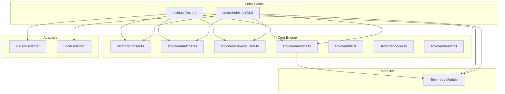
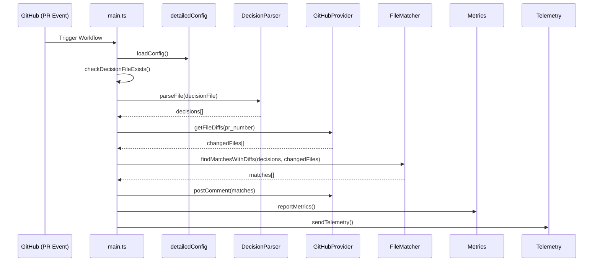
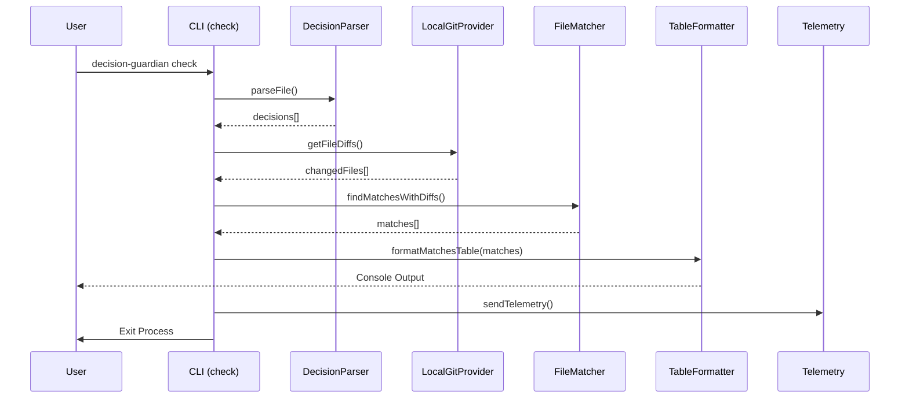

# Decision Guardian Mermaid Diagrams

Use the following Mermaid code to generate images for your documentation. You can use the [Mermaid Live Editor](https://mermaid.live/) to render them.

## 1. System Architecture



## 2. Data Flow (GitHub Action)



## 3. CLI Action Flow



## 4. High-Level Logic Flow

```mermaid
flowchart TD
    Start[Start] --> LoadConfig[Load Configuration]
    LoadConfig --> ValidateConfig{Valid Config?}
    ValidateConfig -- No --> Error[Exit with Error]
    ValidateConfig -- Yes --> ParseDecisions[Parse Decisions File]
    ParseDecisions --> GetDiffs[Get Git Diffs]
    GetDiffs --> BuildTrie[Build Pattern Trie]
    BuildTrie --> LoopFiles{For Each File}
    LoopFiles -- Done --> GenerateComment[Generate Comment/Output]
    LoopFiles -- Next File --> CheckMatch{Match Trie?}
    CheckMatch -- No --> LoopFiles
    CheckMatch -- Yes --> CheckRules{Advanced Rules?}
    CheckRules -- No --> AddMatch[Add to Matches]
    CheckRules -- Yes --> EvalRules[Evaluate Rules]
    EvalRules -- Fail --> LoopFiles
    EvalRules -- Pass --> AddMatch
    AddMatch --> LoopFiles
    GenerateComment --> CheckSeverity{Critical Violation?}
    CheckSeverity -- Yes --> Fail[Fail Build (if configured)]
    CheckSeverity -- No --> Success[Pass Build]
```
